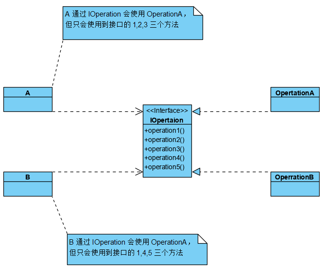
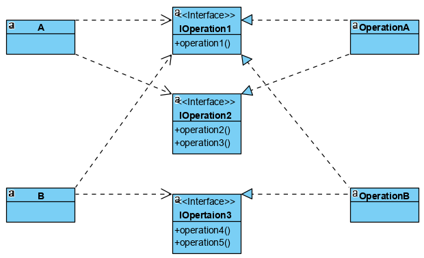
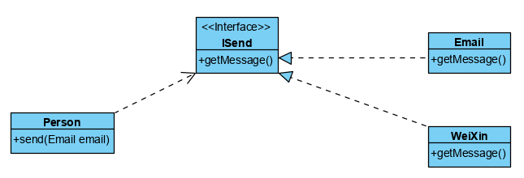
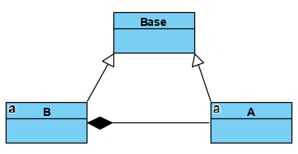
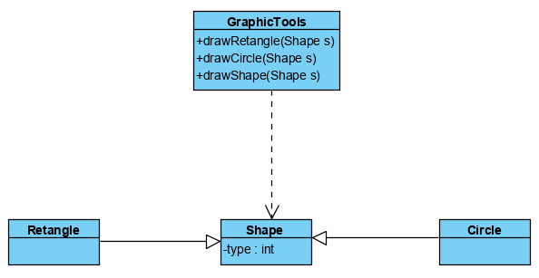
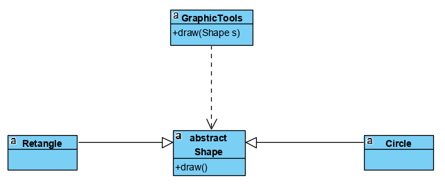
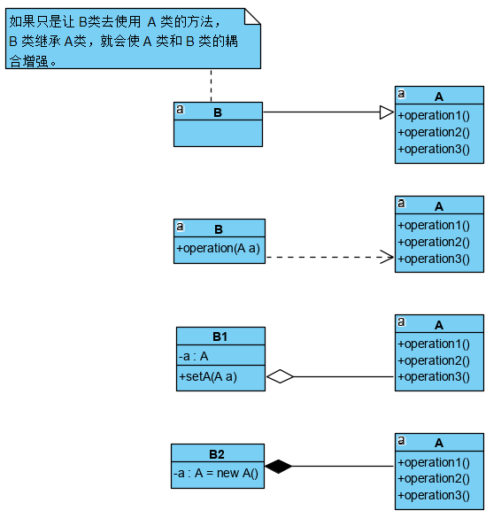

## 设计模式七大原则

设计模式原则，其实就是程序员在编程时，应当遵守的原则，也是各种设计模式的基础。

**常用七大原则**

- 单一职责原则
- 接口隔离原则
- 依赖倒置原则
- 里式替换原则
- 开闭原则
- 迪米特法则
- 合成复用原则

### 单一职责原则

就一个类而言，一个类应该只负责一项职责。比如类 A 负责两个不同职责：职责 1 和 职责 2。当职责 1 需求变更而改变类 A 时，可能会造成职责 2 执行错误，所以需要将 A 的粒度分解成 A1，A2。

**单一职责原则注意事项和细节**

- 降低类的复杂度，一个类只负责一项职责
- 提高类的可读性，可维护性
- 降低变更引起的风险
- 通常情况下，我们应当遵守单一职责原则。只有逻辑足够简单，才可以在代码级违反单一职责原则；只有类中方法数量足够少，可以在方法级别保持单一职责原则。

### 接口隔离原则  

一个类不应该依赖它不需要的接口，即一个类对另一个类的依赖应该建立在最小的接口上。

**示例**

 

```java
/**
 * IOperation
 */
public interface IOperation {

    void operation1();
    void operation2();
    void operation3();
    void operation4();
    void operation5();
}

/**
 * OperationA
 */
public class OperationA implements IOperation {

    @Override
    public void operation1() {
        System.out.println("A 的 operation1 方法");
    }

    @Override
    public void operation2() {
        System.out.println("A 的 operation2 方法");
    }

    @Override
    public void operation3() {
        System.out.println("A 的 operation3 方法");
    }

    @Override
    public void operation4() {
        System.out.println("A 的 operation4 方法");
    }

    @Override
    public void operation5() {
        System.out.println("A 的 operation5 方法");
    }
}

/**
 * OperationB
 */
public class OperationB implements IOperation {

    @Override
    public void operation1() {
        System.out.println("B 的 operation1 方法");
    }

    @Override
    public void operation2() {
        System.out.println("B 的 operation2 方法");
    }

    @Override
    public void operation3() {
        System.out.println("B 的 operation3 方法");
    }

    @Override
    public void operation4() {
        System.out.println("B 的 operation4 方法");
    }

    @Override
    public void operation5() {
        System.out.println("B 的 operation5 方法");
    }
}

/**
 * A
 */
public class A {

    public void operation1(IOperation operation) {
        operation.operation1();
    }

    public void operation2(IOperation operation) {
        operation.operation2();
    }

    public void operation3(IOperation operation) {
        operation.operation3();
    }
}

/**
 * B
 */
public class B {

    public void operation1(IOperation operation) {
      operation.operation1();
    }

    public void operation4(IOperation operation) {
        operation.operation4();
    }

    public void operation5(IOperation operation) {
        operation.operation5();
    }
}

``` 

根据 UML 类图可知，类 A 通过接口 IOperation 依赖类 OperationA，类 B 通过接口 IOperation 依赖类 OperationB。如果接口 IOperation 对于类 A 和类 B 来说不是最小接口，那么类 OperationA 和类 OperationB 必须去实现它们不需要的方法。

**根据接口隔离原则改进**

将 IOperation 接口拆分成几个独立的接口，类 A 和类 B 分别与它们需要的接口建立依赖关系,也就是采用接口隔离原则。



```java
/**
 * IOperation1
 */
public interface IOperation1 {

    void operation1();
}

/**
 * IOperation2
 */
public interface IOperation2 {

    void operation2();
    void operation3();
}

/**
 * IOperation3
 */
public interface IOperation3 {

    void operation4();
    void operation5();
}

/**
 * OperationA
 */
public class OperationA implements IOperation1, IOperation2 {

    @Override
    public void operation1() {
        System.out.println("A 的 operation1 方法");
    }

    @Override
    public void operation2() {
        System.out.println("A 的 operation2 方法");
    }

    @Override
    public void operation3() {
        System.out.println("A 的 operation3 方法");
    }
    
}

/**
 * OperationB
 */
public class OperationB implements IOperation1, IOperation3 {

    @Override
    public void operation1() {
        System.out.println("B 的 operation1 方法");
    }

    @Override
    public void operation4() {
        System.out.println("B 的 operation4 方法");
    }

    @Override
    public void operation5() {
        System.out.println("B 的 operation5 方法");
    }
}

/**
 * A 通过接口 IOperation1，IOperation2 依赖 OperationA 类，  
 *   只实现了 operation1，operation2，operation3 方法
 */
public class A {

    public void operation1(IOperation1 operation) {
        operation.operation1();
    }

    public void operation2(IOperation2 operation) {
        operation.operation2();
    }

    public void operation3(IOperation2 operation) {
        operation.operation3();
    }
}

/**
 * B 通过接口 IOperation1，IOperation3 依赖 OperationB 类，  
 *   只实现了 operation1，operation4，operation5 方法
 */
public class B {

    public void operation1(IOperation1 operation) {
      operation.operation1();
    }

    public void operation4(IOperation3 operation) {
        operation.operation4();
    }

    public void operation5(IOperation3 operation) {
        operation.operation5();
    }
}
```

### 依赖倒置原则  

依赖倒置原则是指：  
1. 高层模块不应该依赖低层模块，两者都应该依赖其抽象。
2. 抽象不应该依赖细节，细节应该依赖抽象。
3. 依赖倒置的中心思想是面向接口编程。
4. 依赖倒置原则是基于这样的设计理念：相对细节的多变性，抽象的东西要稳定的多，故以抽象为基础搭建的架构比以细节为基础搭建的架构要稳定的多。在 Java 中，抽象是指接口或者抽象类，细节就是具体的实现类。
5. 使用接口或抽象类的目的是制定好规范，而不涉及具体的操作，把展现细节的任务交给它们的实现类进行完成。

**示例**

Person 类发送消息的功能。


```java
/**
 * Person
 */
public class Person {

    public void send(Email email) {
        System.out.println(email.getMessage());
    }
}

/**
 * Email
 */
public class Email {

    public String getMessage() {
        return "message";
    }
}
```

上述方案简单，比较容易想到。但是，如果我们发送的对象是微信，短信等等，则新增类，同时 Person 也要增加相应的发送方法，这样对类的改动就比较大。 

**根据依赖倒置原则改进**  

解决思路：引入一个抽象的接口 ISend 来表示发送者，这样 Person 类与接口 ISend 发生依赖，其次 Email，WeiXin 等属于发送的范畴，它们各自实现 ISend 接口,这样就符合依赖倒转原则。



```java
/**
 * ISend
 */
public interface ISend {

    String getMessage();
}

/**
 * Email
 */
public class Email implements ISend {

    @Override
    public String getMessage() {
        return "Email message.";
    }
}


public class WeiXin implements ISend {

    @Override
    public String getMessage() {
        return "WeiXin message.";
    }
}

/**
 * Person
 */
public class Person {

    public void send(ISend send) {
        System.out.println(send.getMessage());
    }
}

```

**依赖倒置的注意事项和细节**

- 低层模块尽量都要有接口或抽象类，或者两者都有，这样程序的稳定性更好。
- 变量的声明尽量是接口或抽象类，这样变量的引用和实际对象间，就存在一个缓冲层，便于程序的扩展和优化。
- 继承时遵循里式替换原则。

**依赖关系传递的三种方式**

- 接口传递

- 构造方法传递

- setter 方法传递

### 里式替换原则

里式替换原则是指，如果对每个类型为 T1 的对象 o1，都有类型为 T2 的对象 o2，使得以 T1 定义的所有程序 P 在所有的对象 o1 都代换成 o2 时，程序 P 的行为没有发生变化，那么类型 T2 是类型 T1 的子类型。**换句话说，所有引用基类的地方必须能透明地使用其子类的对象**。  
在使用继承时，遵循里氏替换原则，在**子类中尽量不要重写父类的方法**。  
里氏替换原则告诉我们，继承实际上让两个类耦合性增强了，在适当的情况下，可以通过**聚合，组合，依赖**来解决问题。

**面向对象编程中继承性的思考和说明**  

1. 继承包含这样一层含义：父类中凡是已经实现的方法，实际上是在设定规范，虽然它不强制要求所有继承它的子类必须遵循这些规范，但是如果子类对这些已经实现的方法任意修改，就会对整个继承体系造成破坏。
2. 继承在给程序带来便利的同时，也带来了弊端。使用继承会给程序带来侵入性，程序的可移植性降低，增加了程序间的耦合性；如果一个类被其他类所继承，在修改这个类时，必须考虑到它所有的子类，并且父类修改后，所涉及到子类的功能可能会故障。
3. 编程中在使用继承时，遵循里式替换原则。

**示例**

```java
/**
 * Main
 */
public class Main {

    public static void main(String[] args) {
        A a = new A();
        System.out.println(a.function1(20, 9)); // 11

        B b = new B();
        System.out.println(b.function1(20, 9));// 本意是求 20 - 9，结果是 20 + 9
        System.out.println(b.function2(20, 9)); // 20 + 9 + 9
    }
}

/**
 * A
 */
public class A {

    /**
     * 返回两数之差
     */
    public int function1(int a, int b) {
        return a - b;
    }
}

/**
 * B 继承 A
 */
public class B extends A {

    /**
     * 重写了父类的方法，可能是无意识的重写
     */
    public int function1(int a, int b) {
        return a + b;
    }

    public int function2(int a, int b) {
        return this.function1(a, b) + 9;
    }
}
```
我们发现原来运行正常的相减功能发生了错误。原因就是类 B 无意中重写了父类的方法，造成原有功能出现错误。在实际编程中，我们常常会通过重写父类的方法完成新的功能，这样写起来虽然简单，但整个继承体系的复用性会比较差，特别是运行多态比较频繁的时候。

**根据里氏替换原则改进**   

将原来的父类和子类都继承一个更通俗的基类，原有的继承关系去掉，采用**依赖，聚合，组合**等关系代替。



```java
/**
 * Base
 */
public class Base {
    /**
     * 将基础的方法和成员写到基类中
     */
}

/**
 * A
 */
public class A extends Base {

    /**
     * 返回两数之差
     */
    public int function1(int a, int b) {
        return a - b;
    }
}

/**
 * B
 */
public class B extends Base {

    private A a = new A();

    /**
     * 重写了父类的方法，可能是无意识的重写
     */
    public int function1(int a, int b) {
        return a + b;
    }

    public int function2(int a, int b) {
        return this.function1(a, b) + 9;
    }

    /**
     * 仍然使用 A 类的方法
     */
    public int function3(int a, int b) {
        return this.a.function1(a, b);
    }
}

/**
 * Main
 */
public class Main {

    public static void main(String[] args) {
        A a = new A();
        System.out.println(a.function1(20, 9)); // 11

        B b = new B();
        System.out.println(b.function3(20, 9));// 使用组合仍然可以使用到A类相关方法
        System.out.println(b.function2(20, 9)); // 20 + 9 + 9
    }
}
```

### 开放封闭原则  

开闭原则(Open Closed Principle)是编程中最基础、最重要的设计原则。一个程序实体，如类，模块和函数应该对扩展开放(对提供方)，对修改关闭(对使用方)。用抽象构建框架，用实现扩展细节。当程序需要变化时，尽量通过扩展程序实体的行为来实现变化，而不是通过修改已有的代码来实现变化。编程中遵循其它原则，以及使用设计模式的目的就是遵循开放封闭原则。

**示例**



```java
/**
 * GraphicTools
 */
public class GraphicTools {

    public void drawShape(Shape s) {

        if (s.getType() == 1) {
            drawRetangle(s);
        } else if (s.getType() == 2) {
            drawCirCle(s);
        }
    }

    public void drawRetangle(Shape s) {
        System.out.println("绘制长方形");
    }

    public void drawCirCle(Shape s) {
        System.out.println("绘制圆形");
    }
}

/**
 * Shape
 */
public class Shape {

    protected int type;

    public int getType() {
        return type;
    }

    public void setType(int type) {
        this.type = type;
    }
}

/**
 * Retangle
 */
public class Retangle extends Shape {

    public Retangle() {
       this.type = 1;
    }
}

/**
 * Circle
 */
public class Circle extends Shape {

    public Circle() {
        this.type = 2;
    }
}

/**
 * Main
 */
public class Main {

    public static void main(String[] args) {
        GraphicTools graphicTools = new GraphicTools();
        graphicTools.drawShape(new Retangle());
        graphicTools.drawShape(new Circle());
    }
}
```
如果此时需要增加一个绘制椭圆的功能，我们需要在 GraphicTools 类中增加此方法，做一些修改，便违反了开放封闭原则，即当我们给类增加新功能的时候，尽量不修改代码，或尽可能少的修改代码。

**根据开放封闭原则改进**

将Shape类做成抽象类，并提供一个抽象的 draw 方法，让子类去实现即可，这样我们有新的图形种类时，只需要让新的图形类继承 Shape,并实现 draw 方法即可，使用方的代码就不需要修改了。



```java
/**
 * GraphicTools
 */
public class GraphicTools {

    public void drawShape(Shape s) {
        s.draw();
    }
}

/**
 * Shape
 */
public abstract class Shape {

    protected abstract void draw();
}

/**
 * Retangle
 */
public class Retangle extends Shape {

    @Override
    protected void draw() {
        System.out.println("绘制长方形");
    }
}

/**
 * Circle
 */
public class Circle extends Shape {

    @Override
    protected void draw() {
        System.out.println("绘制圆形");
    }
}

/**
 * Main
 */
public class Main {

    public static void main(String[] args) {
        GraphicTools graphicTools = new GraphicTools();
        graphicTools.drawShape(new Retangle());
        graphicTools.drawShape(new Circle());
    }
}

```

### 迪米特法则

1. 一个对象应该对其他对象保持最少的了解。  
2. 类与类关系越密切，耦合度越大。
3. 迪米特法则(Demeter Principle)又叫**最少知道原则**，即一个类对自己依赖的类知道的越少越好。也就是说，对于被依赖的类不管多么复杂，都尽量将逻辑封装在类的内部。对外除了提供的 public 方法，不对外泄露任何信息。  
4. 迪米特法则还有个更简单的定义：只与直接的朋友通信。
5. **直接的朋友**：每个对象都会与其他对象有耦合关系，只要两个对象之间有耦合关系，我们就说这两个对象之间是朋友关系。耦合的方式很多，依赖，关联，组合，聚合等。其中，我们称出现成员变量，方法参数，方法返回值中的类为直接的朋友，而出现在局部变量中的类不是直接的朋友。也就是说，陌生的类最好不要以局部变量的形式出现在类的内部。

**迪米特法则注意事项与细节**

- 迪米特法则的核心是降低类之间的耦合。
- 但是注意:由于每个类都减少了不必要的依赖，因此迪米特法则只是要求降低类间(对象间)耦合关系， 并不是要求完全没有依赖关系。


### 合成复用原则

合成复用原则是指，类之间的依赖尽量使用合成/聚合的方式，而不是使用继承。

**示例**




