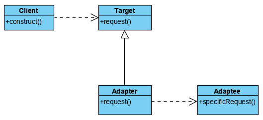

## 适配器模式

适配器模式（Adapter），将一个类的接口转换成客户希望的另外一个借口。适配器模式使得原本由于接口不兼容而不能一起工作的那些类可以一起工作。它主要应用于希望复用一些现存的类，但是接口又于复用环境要求不一致的情况。

适配器模式主要分为三类：对象适配器模式、类适配器模式、接口适配器模式。

### 适配器模式解析

这里主要以对象适配器为例。



**角色介绍**

- Target：客户所期待的接口，可以是具体的或抽象的类，也可以是接口。
- Adaptee：需要适配的类。
- Adapter：通过在内部包装一个 Adaptee 对象，把源接口转换成目标接口。

**适配器模式基本代码**

- Target 类：目标类。

```java
public class Target {

    public void request() {
        System.out.println("普通请求！");
    }
}
```
- Adaptee 类：需要适配的类。

```java
public class Adaptee {

    public void specificRequest() {
        System.out.println("特殊请求！");
    }
}
```

- Adapter 类：适配器类。

```java
public class Adapter extends Target {

    private Adaptee adaptee = new Adaptee();

    @Override
    public void request() {
        adaptee.specificRequest();
    }
}
```

- Main 类

```java
public class Main {

    public static void main(String[] args) {

        Target target = new Adapter();

        target.request();
    }
}
```

### 示例

以充电器为例，充电器本身相当于 Adapter, 220V 交流电相当于被适配者 Adaptee，转换为 5V 直流电相当于目标者。

**对象适配器**

```java
/**
 * Voltage220V
 */
public class Voltage220V {

    public int output220V() {
        return 220;
    }
}

/**
 * Voltage5V
 */
public interface Voltage5V {

    int output5V();
}

/**
 * VoltageAdapter
 */
public class VoltageAdapter implements Voltage5V {

    private Voltage220V voltage220V = new Voltage220V();

    @Override
    public int output5V() {
        int output220V = voltage220V.output220V();

        return output220V / 44;
    }
}

/**
 * Main
 */
public class Main {

    public static void main(String[] args) {

        Voltage5V voltage5V = new VoltageAdapter();

        System.out.println(voltage5V.output5V());
    }
}
```
对象适配器，遵循合成复用原则，使用成本低，并且灵活。

**类适配器**

```java
/**
 * Voltage220V
 */
public class Voltage220V {

    public int output220V() {
        return 220;
    }
}

/**
 * Voltage5V
 */
public interface Voltage5V {

    int output5V();
}

/**
 * VoltageAdapter
 */
public class VoltageAdapter extends Voltage220V implements Voltage5V {

    @Override
    public int output5V() {
        int output220V = this.output220V();

        return output220V / 44;
    }
}

/**
 * Main
 */
public class Main {

    public static void main(String[] args) {

        Voltage5V voltage5V = new VoltageAdapter();

        System.out.println(voltage5V.output5V());
    }
}
````
由于 Java 是单继承机制，所以类适配器需要继承被适配类，有一定局限性；被适配类的方法在 Adapter 中都会暴露出来，也增加了使用的成本。但是其继承了被适配类，所以它可以根据需求重写被适配类中的方法，使得Adapter 的灵活性增强了。


**接口适配器**

当不需要全部实现接口提供的方法时，可先设计一个抽象类实现接口，并为该接口中每个方法提供一个默认实现(空方法)，那么该抽象类的子类可有选择地覆盖父类的某些方法来实现需求。适用于一个接口不想使用其所有的方法的情况。

```java
/**
 * Voltage
 */
public interface Voltage {

    int output5V();

    int output10V();

    int output20V();
}

/**
 * AbstractVoltage
 */
public abstract class AbstractVoltage implements Voltage {

    @Override
    public int output5V() {
        return 0;
    }

    @Override
    public int output10V() {
        return 0;
    }

    @Override
    public int output20V() {
        return 0;
    }
}

/**
 * Voltage220V
 */
public class Voltage220V {

    public int output220V() {
        return 220;
    }
}

/**
 * Voltage5V
 */
public class Voltage5V extends AbstractVoltage {

    private Voltage220V voltage220V = new Voltage220V();

    @Override
    public int output5V() {
        int v = voltage220V.output220V();
        return v / 44;
    }
}

/**
 * Main
 */
public class Main {

    public static void main(String[] args) {

        Voltage5V voltage5V = new Voltage5V();

        System.out.println(voltage5V.output5V());
    }
}
```

### 小结

一般地，使用一个已经存在的类，但如果它的接口，也就是它的方法和要求不相同时，就可以考虑使用适配器模式。


