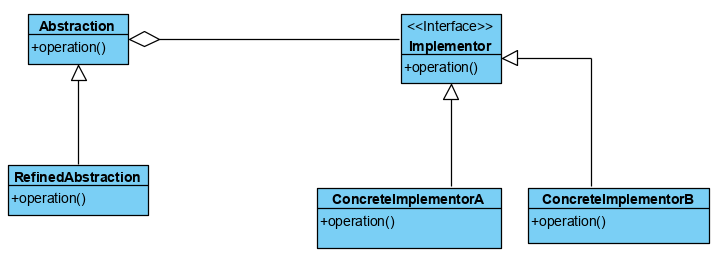

## 桥接模式

桥接模式（Bridge），将抽象部分和它的实现部分分离，使它们都可以独立地变化。  

桥接模式基于类的最小设计原则，通过使用封装、聚合及继承等行为让不同的类承担不同的职责。它的主要特点是把抽象与行为实现分离开来，从而可以保持各部分的独立性以及应对它们的功能扩展。

也就是说，实现系统可能有多种方式分类，每一种分类都有可能变化。桥接模式的核心意图就是把这些分类独立出来，让它们各自独立变化，减少它们之间的耦合。

### 桥接模式解析



**角色介绍**

- Abstraction：维护了 Implementor 类，两者是聚合关系，Abstraction 充当桥接类。
- RefinedAbstraction：是 Abstraction 抽象类的子类。
- Implementor：行为实现类的接口。
- ConcreteImplementorA/ConcreteImplementorA：行为的具体实现类。

**桥接模式基本代码**

- Abstraction 类

```java
public abstract class Abstraction {

    private Implementor implementor;

    public Abstraction(Implementor implementor) {
        this.implementor = implementor;
    }

    protected void operation() {
        implementor.operation();
    }
}
```

- RefinedAbstraction 类

```java
public class RefinedAbstraction extends Abstraction {

    public RefinedAbstraction(Implementor implementor) {
        super(implementor);
    }

    @Override
    protected void operation() {
        super.operation();
    }
}
```

- Implementor 类

```java
public interface Implementor {

    void operation();
}
```

- ConcreteImplementorA 类

```java
public class ConcreteImplementorA implements Implementor {

    @Override
    public void operation() {
        System.out.println("具体实现 A 的方法执行");
    }
}
```

- ConcreteImplementorB 类

```java
public class ConcreteImplementorB implements Implementor {

    @Override
    public void operation() {
        System.out.println("具体实现 B 的方法执行");
    }
}
```

- Main 类

```java
public class Main {

    public static void main(String[] args) {
        Implementor implementorA = new ConcreteImplementorA();
        Abstraction refinedAbstractionA = new RefinedAbstraction(implementorA);
        refinedAbstractionA.operation();

        Implementor implementorB = new ConcreteImplementorB();
        Abstraction refinedAbstractionB = new RefinedAbstraction(implementorB);
        refinedAbstractionB.operation();
    }
}
```


