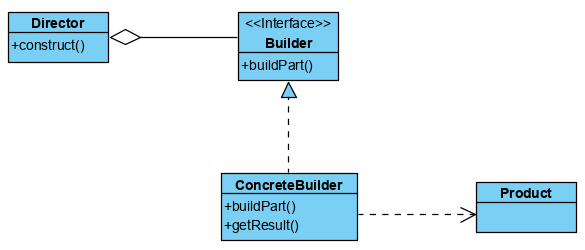

## 建造者模式

建造者模式(Builder)，又叫生成器模式，是一种对象构建模式。它将一个复杂对象的构建与它的表示分离，使得同样的构建过程可以创建不同的表示。  
建造者模式可以将一个产品的内部表象和产品的生成过程分割开来，从而可以使一个建造过程生成具有不同的内部表象的产品对象。如果我们用了建造者模式，那么用户就只需指定需要建造的类型就可以得到它们，而具体建造的过程和细节就不需要知道了。

### 建造者模式解析



**角色介绍**

- Product（产品角色）：具体产品对象。
- Builder（抽象建造者）：是为创建一个 Product 对象的各个部件指定的抽象接口。
- ConcreteBuilder（具体建造者）：实现 Builder 接口，构建和装配各个部件。
- Director（指挥者）：是构建一个使用 Builder 接口的对象。它主要是用于创建一个复杂的对象。 它主要有两个作用，一是隔离了客户与对象的生产过程，二是负责控制产品对象的生产过程。

**建造者模式基本代码**

- Product 类：产品类，由多个部件组成。

```java
public class Product {

    private List<String> parts = new ArrayList<>();

    /**
     * 添加部件
     */
    public void add(String part) {
        this.parts.add(part);
    }

    /**
     * 列举所有部件
     */
    public void show() {
        this.parts.forEach(System.out::println);
    }
}
```

- Builder 类：抽象建造者类，确定产品由两个部件 PartA 和 PartB 组成，并声明一个得到产品结果的方法 getResult()。

```java
public interface Builder {

    void buildPartA();

    void buildPartB();

    Product getResult();
}
```

- ConcreteBuilderA 类：具体建造者 A。

```java
public class ConcreteBuilderA implements Builder {

    private Product product = new Product();

    @Override
    public void buildPartA() {
        product.add("X");
    }

    @Override
    public void buildPartB() {
        product.add("Y");
    }

    @Override
    public Product getResult() {
        return product;
    }
}
```

- ConcreteBuilderB 类：具体建造者 B。 

```java
public class ConcreteBuilderB implements Builder {

    private Product product = new Product();

    @Override
    public void buildPartA() {
        product.add("M");
    }

    @Override
    public void buildPartB() {
       product.add("N");
    }

    @Override
    public Product getResult() {
        return product;
    }
}
```
- Director 类：指挥者类。

```java
public class Director {

    public void build(Builder builder) {
        builder.buildPartA();
        builder.buildPartB();
    }
}
```

- Main 类

```java
public class Main {

    public static void main(String[] args) {
        Director director = new Director();

        ConcreteBuilderA builderA = new ConcreteBuilderA();
        ConcreteBuilderB builderB = new ConcreteBuilderB();

        director.build(builderA);
        Product resultA = builderA.getResult();
        resultA.show();

        director.build(builderB);
        Product resultB = builderB.getResult();
        resultB.show();
    }
}
```

### 示例

需求：盖房子，过程有打桩、砌墙、封顶。房子有各种各样的，比如普通房，高楼，别墅，各种房子的过程虽然一样，但是要求不相同的。

**传统写法**

```java
/**
 * House
 */
public class House {

    private Integer length;

    private Integer width;

    private Integer high;

    public Integer getLength() {
        return length;
    }

    public void setLength(Integer length) {
        this.length = length;
    }

    public Integer getWidth() {
        return width;
    }

    public void setWidth(Integer width) {
        this.width = width;
    }

    public Integer getHigh() {
        return high;
    }

    public void setHigh(Integer high) {
        this.high = high;
    }

    @Override
    public String toString() {
        return "House{" +
                "length=" + length +
                ", width=" + width +
                ", high=" + high +
                '}';
    }
}

/**
 * 普通房子
 */
public class CommonHouseBuilder {
    
    public House build() {
        House house = new House();
        house.setLength(50);
        house.setWidth(20);
        house.setHigh(5);

        return house;
    }
}

/**
 * 高房子
 */
public class HighHouseBuilder {

    public House build() {
        House house = new House();
        house.setLength(60);
        house.setWidth(30);
        house.setHigh(6);

        return house;
    }
}

/**
 * Main
 */
public class Main {

    public static void main(String[] args) {
        // 普通房子
        CommonHouseBuilder commonHouseBuilder = new CommonHouseBuilder();
        House commonHouse = commonHouseBuilder.build();
        System.out.println(commonHouse.toString());

        // 高房子
        HighHouseBuilder highHouseBuilder = new HighHouseBuilder();
        House highHouse = highHouseBuilder.build();
        System.out.println(highHouse.toString());

    }
}
```
上面这种写法将建造过程和表象都放在了一起，耦合性很强，而且普通房子和高房子的建造过程是一样的，只是内部的细节不同，代码是可以复用的。如果我们又要进行别墅的建造，建造过程我们又要重新写一遍，而且很容易漏写步骤。所以让我们使用建造者模式改进。


**使用建造者模式改进**

```java
/**
 * House
 */
public class House {

    private Integer length;

    private Integer width;

    private Integer high;

    public Integer getLength() {
        return length;
    }

    public void setLength(Integer length) {
        this.length = length;
    }

    public Integer getWidth() {
        return width;
    }

    public void setWidth(Integer width) {
        this.width = width;
    }

    public Integer getHigh() {
        return high;
    }

    public void setHigh(Integer high) {
        this.high = high;
    }

    @Override
    public String toString() {
        return "House{" +
                "length=" + length +
                ", width=" + width +
                ", high=" + high +
                '}';
    }
}

/**
 * Builder
 */
public interface Builder {

    void buildPartA();

    void buildPartB();

    Product getResult();
}

/**
 * 普通房子建造者
 */
public class CommonHouseBuilder implements HouseBuilder {

    private House house = new House();

    @Override
    public void buildHigh() {
        house.setHigh(5);
    }

    @Override
    public void buildWidth() {
        house.setWidth(20);
    }

    @Override
    public void buildLength() {
       house.setLength(50);
    }

    @Override
    public House getResult() {
        return house;
    }
}

/**
 * 高房子建造者
 */
public class HighHouseBuilder implements HouseBuilder {

    private House house = new House();

    @Override
    public void buildHigh() {
        house.setHigh(6);
    }

    @Override
    public void buildWidth() {
        house.setWidth(30);
    }

    @Override
    public void buildLength() {
        house.setLength(60);
    }

    @Override
    public House getResult() {
        return house;
    }
}

/**
 * HouseDirector
 */
public class HouseDirector {

    public void buildHouse(HouseBuilder houseBuilder) {
        houseBuilder.buildHigh();
        houseBuilder.buildLength();
        houseBuilder.buildWidth();
    }
}

/**
 * Main
 */
public class Main {

    public static void main(String[] args) {
        HouseDirector houseDirector = new HouseDirector();
        // 普通房子
        CommonHouseBuilder commonHouseBuilder = new CommonHouseBuilder();
        houseDirector.buildHouse(commonHouseBuilder);
        House commonHouse = commonHouseBuilder.getResult();
        System.out.println(commonHouse.toString());

        // 高房子
        HighHouseBuilder highHouseBuilder = new HighHouseBuilder();
        houseDirector.buildHouse(highHouseBuilder);
        House highHouse = highHouseBuilder.getResult();
        System.out.println(highHouse.toString());

    }
}
```

### 小结

建造者模式，主要用于创建一些复杂的对象，这些对象内部构建间的建造顺序通常是稳定的，但对象内部的构建通常面临复杂的变化。而建造者模式的好处就是使得建造代码与表示代码分离，由于建造者隐藏了该产品的构建过程，所以如果要改变一个产品内部的表示，只需再定义一个具体的建造者就可以了。

最后，建造者模式是逐步建造产品的，所以建造者的 Builder 类里的那些建造方法必须是足够普遍的，以便为各类型的具体建造者构造。如果产品的差异性较大，就不适合使用建造者模式。


