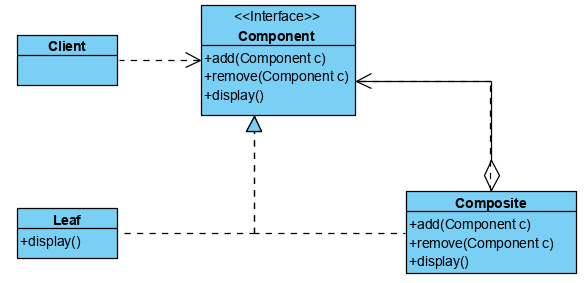
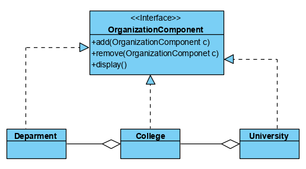

## 组合模式

组合模式(Composite)，将对象组合成树形结构以表示“部分-整体”的层次结构。组合模式使得用户对单个对象和组合对象的使用具有一致性。

### 组合模式解析



**角色介绍**

- Component：组合中的对象声明接口，在适当情况下，实现所有类共有接口的默认行为。声明一个接口用于访问和管理 Component 的子部件。

- Leaf：在组合中表示叶节点对象，叶节点没有子节点。

- Composite：定义有枝节点行为，用来存储子部件，在 Component 接口中实现与子部件有关的操作，比如增加 Add 和删除 Remove。

**组合模式基本代码**

- Component 类

```java
/**
 * Component
 */
public abstract class Component {

    private String name;

    public Component(String name) {
        this.name = name;
    }

    public abstract void add(Component component);

    public abstract void remove(Component component);

    public abstract void display();

    public String getName() {
        return name;
    }

    public void setName(String name) {
        this.name = name;
    }
}

```

- Composite 类

```java
/**
 * Composite
 */
public class Composite extends Component {
    /**
     * 存放子节点
     */
    List<Component> childCompoents = new LinkedList<>();

    public Composite(String name) {
        super(name);
    }

    @Override
    public void add(Component component) {
        this.childCompoents.add(component);
    }

    @Override
    public void remove(Component component) {
        this.childCompoents.remove(component);
    }

    @Override
    public void display() {
        System.out.println("========" + this.getName() + "==========");
        // 遍历子节点
        for (Component c : childCompoents) {
            c.display();
        }
    }
}
```

- Leaf 类

```java
/**
 * Leaf
 */
public class Leaf extends Component {

    public Leaf(String name) {
        super(name);
    }

    @Override
    public void add(Component component) {
        throw new IllegalStateException("Cannot add to a leaf");
    }

    @Override
    public void remove(Component component) {
        throw new IllegalStateException("Cannot remove from a leaf");
    }

    @Override
    public void display() {
        // 只打印叶子节点，叶子节点没有子节点
        System.out.println(this.getName());
    }
}
```

### 示例

展示一个学校院系结构，一个学校有多个学院，一个学院有多个专业。

**类结构图**



**编码**

- OrganizationComponent 类

```java
/**
 * OrganizationComponent
 */
public abstract class OrganizationComponent {

	private String name;

	public OrganizationComponent(String name) {
		this.name = name;
	}

	protected abstract void add(OrganizationComponent organizationComponent);
	
	protected abstract void remove(OrganizationComponent organizationComponent);

	protected abstract void print();

	public String getName() {
		return name;
	}

	public void setName(String name) {
		this.name = name;
	}
	
}
```

- University 类

```java
/**
 * University 就是 Composite , 可以管理 College
 */
public class University extends OrganizationComponent {

	List<OrganizationComponent> organizationComponents = new LinkedList<>();

	public University(String name) {
		super(name);
	}

	@Override
	protected void add(OrganizationComponent organizationComponent) {
		organizationComponents.add(organizationComponent);
	}

	@Override
	protected void remove(OrganizationComponent organizationComponent) {
		organizationComponents.remove(organizationComponent);
	}

	@Override
	protected void print() {
		System.out.println("--------------" + getName() + "--------------");
		// 遍历 organizationComponents
		for (OrganizationComponent organizationComponent : organizationComponents) {
			organizationComponent.print();
		}
	}

}
```

- College 类

```java
/**
 * College 学院
 */
public class College extends OrganizationComponent {

	/**
	 *  存放节点
	 */
	List<OrganizationComponent> organizationComponents = new LinkedList<OrganizationComponent>();

	public College(String name) {
		super(name);
	}

	@Override
	protected void add(OrganizationComponent organizationComponent) {
		//  将来实际业务中，Colleage 的 add 和  University add 不一定完全一样
		organizationComponents.add(organizationComponent);
	}

	@Override
	protected void remove(OrganizationComponent organizationComponent) {
		organizationComponents.remove(organizationComponent);
	}


	@Override
	protected void print() {
		System.out.println("--------------" + getName() + "--------------");
		// 遍历 organizationComponents
		for (OrganizationComponent organizationComponent : organizationComponents) {
			organizationComponent.print();
		}
	}

}
```

- Department 类

```java
/**
 * Department
 */
public class Department extends OrganizationComponent {

	public Department(String name) {
		super(name);
	}

	@Override
	protected void add(OrganizationComponent organizationComponent) {
		throw new UnsupportedOperationException();
	}

	@Override
	protected void remove(OrganizationComponent organizationComponent) {
       throw new UnsupportedOperationException();
	}

	@Override
	protected void print() {
		System.out.println(this.getName());
	}
}
```

- Main 类

```java
public class Main {

	public static void main(String[] args) {
		// 学校
		OrganizationComponent university = new University("清华大学");
		
		// 创建学院
		OrganizationComponent infoEngineerCollege = new College("信息工程学院");

		// 创建各个学院下面的专业
		infoEngineerCollege.add(new Department("软件工程"));
		infoEngineerCollege.add(new Department("网络工程"));
		infoEngineerCollege.add(new Department("计算机科学与技术"));
		
		//将学院加入到学校
		university.add(infoEngineerCollege);

		university.print();
	}
}
```

### 小结

在组合模式中，基本对象可以被组合成更复杂的组合对象，而这个组合对象又可以被组合，这样不断地递归下去，客户代码中，任何用到基本对象的地方都可以使用组合对象了。用户是不用关心到底是处理一个叶节点还是处理一个组合组件，也就用不着为定义组合而写一些选择判断语句了。组合模式让客户可以一致地使用组合结构和单个对象。

如果你发现需求中是体现部分与整体层次的结构时，以及你希望用户可以忽略组合对象与单个对象的不同，统一地使用组合结构中的所有对象时，就应该考虑用组合模式了。


