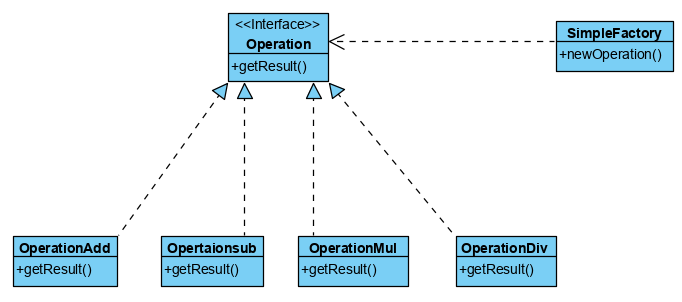
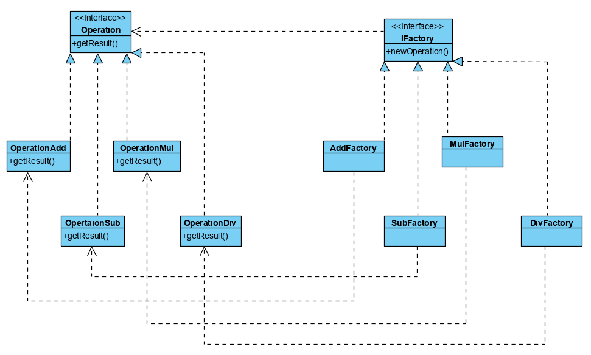
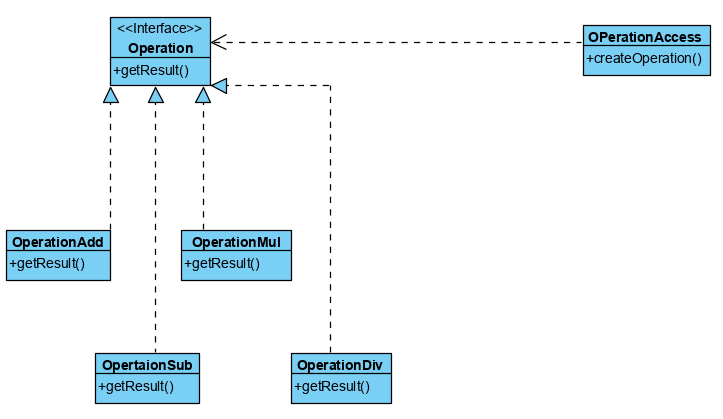

## 工厂模式 & 抽象工厂模式

当我们有一个具有多个子类的超类并且基于不同的输入，需要返回一个子类时，将使用工厂设计模式。这种模式消除了从客户端程序到工厂类的实例化的责任。注意，此模式也称为“工厂方法模式”。

**示例**

实现两数的加、减、乘、除运算。

```java
/**
 * Operation 运算类
 */
public class Operation {

    public static double getResult(double numberA, double numberB, String operate) {
        double result = 0;

        if (Objects.equals(operate, "+")) {
            result = numberA + numberB;
        } else if (Objects.equals(operate, "-")) {
            result = numberA - numberB;
        } else if (Objects.equals(operate, "*")) {
            result = numberA * numberB;
        } else if (Objects.equals(operate, "/")) {
            result = numberA / numberB;
        }

        return result;
    }
}


/**
 * Main
 */
public class Main {

    public static void main(String[] args) {
        double numberA = 20;
        double numberB = 15;
        String operate = "*";

        double result = Operation.getResult(numberA, numberB, operate);

        System.out.println("计算结果是：" + result);
    }
}
```
上面的实现方式虽然简单且易于理解，但是当我们再增加一个新的运算（比如立方运算）时，就要对 Operation 类中的运算方法进行修改，这样可能会使得本来运行良好的功能代码发生意外的变化，导致程序发生异常。所以我们需要将代码进行改进。

### 简单工厂模式

简单工厂模式是属于创建型模式，是工厂模式的一种，是由一个工厂对象决定创建出哪一种产品类的实例。简单工厂模式是工厂模式家族中最简单实用的模式。  
简单工厂模式：定义了一个创建对象的类，由这个类来封装实例化对象的行为(代码)。在软件开发中，当我们会用到大量的创建某种、某类或者某批对象时，就会使用到工厂模式。


**使用简单工厂模式改进**



```java
/**
 * Operation
 */
public interface Operation {

    double getResult(double numberA, double numberB);
}

/**
 * OperationAdd 加法运算
 */
public class OperationAdd implements Operation {

    @Override
    public double getResult(double numberA, double numberB) {
        return numberA + numberB;
    }
}

/**
 * OperationSub 减法运算
 */
public class OperationSub implements Operation {

    @Override
    public double getResult(double numberA, double numberB) {
        return numberA - numberB;
    }
}

/**
 * OperationMul 乘法运算
 */
public class OperationMul implements Operation {

    @Override
    public double getResult(double numberA, double numberB) {
        return numberA * numberB;
    }
}

/**
 * OperationDiv 除法运算
 */
public class OperationDiv implements Operation {

    @Override
    public double getResult(double numberA, double numberB) {
        if (numberB == 0) {
            throw new ArithmeticException("除数不能为 0！");
        }
        return numberA / numberB;
    }
}

/**
 * SimpleFactory
 */
public class SimpleFactory {

    public static Operation newOperation(String operate) {

        Operation operation = null;
        if (Objects.equals(operate, "+")) {
            operation = new OperationAdd();
        } else if (Objects.equals(operate, "-")) {
            operation = new OperationSub();
        } else if (Objects.equals(operate, "*")) {
            operation = new OperationMul();
        } else if (Objects.equals(operate, "/")) {
            operation = new OperationDiv();
        }

        return operation;
    }
}

/**
 * Main
 */
public class Main {

    public static void main(String[] args) {
        double numberA = 20;
        double numberB = 15;
        String operate = "*";

        Operation operation = SimpleFactory.newOperation(operate);
        double result = operation.getResult(numberA, numberB);

        System.out.println(result);
    }
}
``` 

如果我们需要对其中的运算进行修改，只需修改它相应的运算类即可；如果需要增加新的运算方式，只需增加相应的运算子类，然后在工厂类里增加一个判断分支，添加相应的实例化代码。

简单工厂模式的最大优点在于工厂类中包含了必要的逻辑判断，根据客户端的选择条件动态实例化相关的类，对于客户端来说，去除了与具体产品的依赖。但是每当要增加一个新的功能时，都要到工厂类的方法里增加一个分支条件，这样就违背了开放封闭原则。

### 工厂模式  

工厂模式（Factory Method），定义一个用于创建对象的接口，让子类决定实例化哪一个类。工厂模式使一个类的实例化延迟到其子类。

**使用工厂模式改进**



```java
/**
 * Operation
 */
public interface Operation {

    double getResult(double numberA, double numberB);
}

/**
 * OperationAdd 加法运算
 */
public class OperationAdd implements Operation {

    @Override
    public double getResult(double numberA, double numberB) {
        return numberA + numberB;
    }
}

/**
 * OperationSub 减法运算
 */
public class OperationSub implements Operation {

    @Override
    public double getResult(double numberA, double numberB) {
        return numberA - numberB;
    }
}

/**
 * OperationMul 乘法运算
 */
public class OperationMul implements Operation {

    @Override
    public double getResult(double numberA, double numberB) {
        return numberA * numberB;
    }
}

/**
 * OperationDiv 除法运算
 */
public class OperationDiv implements Operation {

    @Override
    public double getResult(double numberA, double numberB) {
        if (numberB == 0) {
            throw new ArithmeticException("除数不能为 0！");
        }
        return numberA / numberB;
    }
}

/**
 * IFactory
 */
public interface IFactory {

    Operation newOperation();
}

/**
 * AddFactory 加法工厂类
 */
public class AddFactory implements IFactory {

    @Override
    public Operation newOperation() {
        return new OperationAdd();
    }
}

/**
 * SubFactory 减法工厂类
 */
public class SubFactory implements IFactory {

    @Override
    public Operation newOperation() {
        return new OperationSub();
    }
}

/**
 * MulFactory 乘法工厂类
 */
public class MulFactory implements IFactory {

    @Override
    public Operation newOperation() {
        return new OperationMul();
    }
}

/**
 * DivFactory 除法工厂类
 */
public class DivFactory implements IFactory {

    @Override
    public Operation newOperation() {
        return new OperationDiv();
    }
}

/**
 * OperateType
 */
public enum OperateType {

    ADD, MUL, DIV, SUB
}

/**
 * OperateFactoryMaker
 */
public class OperateFactoryMaker {

    public static IFactory makeFactory(OperateType type) {

        if (Objects.equals(OperateType.ADD, type)) {
            return new AddFactory();
        } else if (Objects.equals(OperateType.SUB, type)) {
            return new SubFactory();
        } else if (Objects.equals(OperateType.MUL, type)) {
            return new MulFactory();
        } else if (Objects.equals(OperateType.DIV, type)) {
            return new DivFactory();
        }

        throw new IllegalArgumentException("OperateType not supported.");
    }

/**
 * Main
 */
public class Main {

    public static void main(String[] args) {
        double numberA = 20;
        double numberB = 15;
        Operation operation = OperateFactoryMaker.makeFactory(OperateType.MUL).newOperation();
        double result = operation.getResult(numberA, numberB);

        System.out.println(result);
    }
}
```

工厂模式克服了简单工厂模式违背开放封闭原则的缺点，又保持了封装对象创建过程的优点。它们都是集中封装了对象的创建，使得要更换对象时，不需要做大的改动就可实现，降低了客户程序与产品对象的耦合。工厂模式是简单工厂模式的进一步抽象和推广。由于使用了多态性，工厂方法模式保持了简单工厂模式的优点，而且克服了它的缺点。但缺点是由于每加一个产品，就需要加一个产品工厂的类，增加了额外的开发量。

### 抽象工厂模式  

抽象工厂模式定义了一个接口用于创建相关或有依赖关系的对象簇，而无需指明且体的类。抽象工厂模式是**将简单工厂模式和工厂模式进行整合**。从设计层面看，抽象工厂模式就是对简单工厂模式的改进(或者称为进一步的抽象)。将工厂抽象成两层，抽象工厂和具体实现的工厂子类。程序员可以根据创建对象类型使用对应的工厂子类。这样将单个的简单工厂类变成了工厂簇更利于代码的维护和扩展。

**使用抽象工厂模式改进** 



```java
/**
 * Operation
 */
public interface Operation {

    double getResult(double numberA, double numberB);
}

/**
 * OperationAdd 加法运算
 */
public class OperationAdd implements Operation {

    @Override
    public double getResult(double numberA, double numberB) {
        return numberA + numberB;
    }
}

/**
 * OperationSub 减法运算
 */
public class OperationSub implements Operation {

    @Override
    public double getResult(double numberA, double numberB) {
        return numberA - numberB;
    }
}

/**
 * OperationMul 乘法运算
 */
public class OperationMul implements Operation {

    @Override
    public double getResult(double numberA, double numberB) {
        return numberA * numberB;
    }
}

/**
 * OperationDiv 除法运算
 */
public class OperationDiv implements Operation {

    @Override
    public double getResult(double numberA, double numberB) {
        if (numberB == 0) {
            throw new ArithmeticException("除数不能为 0！");
        }
        return numberA / numberB;
    }
}

/**
 * OperationAccess 利用反射技术实例化对象
 */
public class OperationAccess {

    public static Operation createOperation(Class<? extends Operation> clazz) {
        Operation operation = null;
        try {
            operation = clazz.newInstance();
        } catch (InstantiationException e) {
            e.printStackTrace();
        } catch (IllegalAccessException e) {
            e.printStackTrace();
        }
        return operation;
    }
}
```
一般来说，所有在用简单工厂的地方，都可以考虑用反射技术来去除 switch 或 if，解除分支判断带来的耦合。

### 小结

工厂模式是将实例化对象的代码提取出来，放到一个类中统一管理和维护，达到与主项目的依赖关系的解耦目的，从而提高项目的扩展和维护性，例如，我们可以很容易地更改 Operation 类的实现，而客户端程序并不会意识到这一点。在创建对象实例时，不要直接 new 类，而是把这个 new 类的动作放在一个工厂的方法中并返回。


